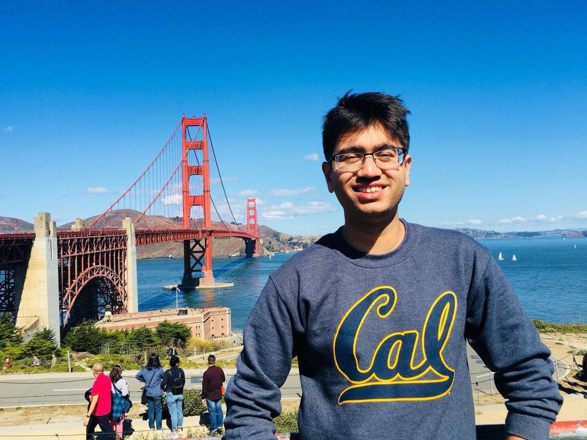

## About Me
Hi! My name is Raj and I am a graduate student at UC Berkeley. I obtained my undergraduate degree in Computer Science from the University of Pune, India in 2018. Presently, I am in the process of obtaining my masters degree in Information Management Systems. from the School of Information at UC Berkeley. My interests are data science, machine learning and computer security. I am advised by [Prof. Dawn Song](https://people.eecs.berkeley.edu/~dawnsong/) and [Prof. Hany Farid](https://farid.berkeley.edu/). I also work as a teaching assistant with [Prof. Zachary Pardos](ischool.berkeley.edu/people/zachary-pardos). I have been extremeley fortunate to have worked with [Dr. Sadia Afroz](https://www1.icsi.berkeley.edu/~sadia/).   
I like using my data science and coding skills to solve real world problems, and uncover hidden patterns from large datasets. I have experience working with Natural Language Processing, log analysis, malware detection, adversarial machine learning.I have previously worked on solving problems like fake news detection and hate speech classification.   
Presently, I am working with [Facebook AI Research](https://ai.facebook.com/) to develop a zero-shot learning embedding space for hoax articles, and developing classifiers for fake news detection. 

---

## Publications

* [Malware Detection on Highly Imbalanced Data through Sequence Modeling](https://drive.google.com/file/d/1weet3fTRddJSL66P1gIo9MgKIhRLOV6h/view?usp=sharing)  by **Rajvardhan Oak**, Min Du, David Yan, Harshavardhan Takawale and Idan Amit. 
In *Proceedings of the 12th ACM Workshop on Artificial Intelligence and Security* (**AISec 2019**)
* [Lifelong Anomaly Detection Through Unlearning](https://drive.google.com/file/d/1Z8fcNdgVtfX4ekzi6hyKGgxMN2HBbFFl/view?usp=sharing)  by Min Du, Zhi Chen, Chang Liu, **Rajvardhan Oak** and Dawn Song. 
In *Proceedings of the 2019 ACM SIGSAC Conference on Computer and Communications Security* (**CCS 2019**).
* [Poster: Adversarial Examples for Hate Speech Classifiers](https://drive.google.com/file/d/1kx6y7Tz_nX5wT7G4JggQQl3LKjcw9k6A/view?usp=sharing)  by **Rajvardhan Oak**  In *Proceedings of the 2019 ACM SIGSAC Conference on Computer and Communications Security* (**CCS 2019**).
* [Poster: Using Generative Adversarial Networks for Secure Pseudorandom Number Generation](https://drive.google.com/file/d/1FVc9DQUUYZbddMVom3UY5GETNJIPNj2G/view?usp=sharing) by **Rajvardhan Oak**, Chaitanya Rahalkar and Dhaval Gujar. In *Proceedings of the 2019 ACM SIGSAC Conference on Computer and Communications Security* (**CCS 2019**).

---
## Research
**_Malware Detection in Highly Imbalance Datasets_**. Malware is a malicious program which can steal sensitive information (financial details, passwords) and send them to adversaries, or use system resources to an adversary’s benefit (e.g. bitcoin mining). In the real world, the ratio of labeled malware samples ranges from about 0.1% - 2%, leading to a highly imbalanced datasets, which is a problem for machine learning methods. My research was in addressing the problem of high imbalance in malware detection. Inspired by the results shown by transfer learning in NLP and image processing tasks, we use a model called BERT, which relies on high pretraining to generate contextual embeddings. Using BERT, we are able to detect malware samples with an F-1 score of more than 90%, even when our data contains only 5% malware samples. An interesting finding from our research is that pretraining on NLP data helps improve the F-1 score by 3%.

**_Lifelong Anomaly Detection_**. Anomaly detection is essential towards ensuring system security and reliability. 
We find that existing approaches are not easy to adopt such new knowledge to improve system performance. We propose novel approaches to handle challenges associated with lifelong anomaly detection. In particular, we propose a framework called <i>unlearning</i>, which can effectively correct the model when a false negative (or a false positive) is labeled. To this aim, we develop several novel techniques to tackle two challenges referred to as exploding loss and catastrophic forgetting. 
We evaluate our approach using two state-of-the-art zero-positive deep learning anomaly detection architectures and three real-world tasks. The results show that the proposed approach is able to significantly reduce the number of false positives and false negatives through unlearning.

---
## Teaching
**Fall 2019**
- [INFO 254/DATA 144 : Data Mining and Analytics](https://www.ischool.berkeley.edu/courses/info/254) with _Prof. Zachary Pardos_
- [INFO 289: Public Interest Cybersecurity: The Citizen Clinic Practicum](https://www.ischool.berkeley.edu/courses/info/289) with _Prof. Steve Weber_

**Spring 2019**
- [INFO 254/DATA 144 : Data Mining and Analytics](https://www.ischool.berkeley.edu/courses/info/254) with _Prof. Zachary Pardos_

**Fall 2018**
- [INFO 260: Machine Learning in Education](https://www.ischool.berkeley.edu/courses/info/260f) with _Prof. Zachary Pardos_
- [INFO W205: Foundations of Data Engineering](https://www.ischool.berkeley.edu/courses/datasci/205) with _Prof. Kevin Crook_

